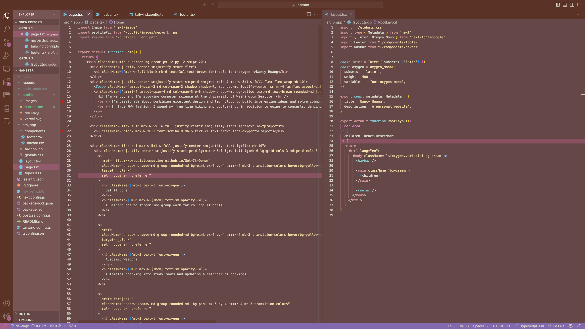

<h1 align="center">
  mauvey
</h1>

  A very mauvey dark theme for VSCode. ✍(◔◡◔)

  

## Installation

### With VS Code:
1. Open **Extensions** sidebar panel in VS Code. `View → Extensions`
2. Search for `mauvey`
3. Click **Install** to install it
4. Click **Reload** to reload the editor
5. Code > Preferences > Color Theme > **mauvey**

### Manually:
Refer to the [VSC Extension Quickstart Guide](https://github.com/bchiang7/halcyon-vscode/blob/master/vsc-extension-quickstart.md)

<h2 align="center">(◔◡◔) Enjoy and have a mauve-olous day! (◔◡◔)</h2>